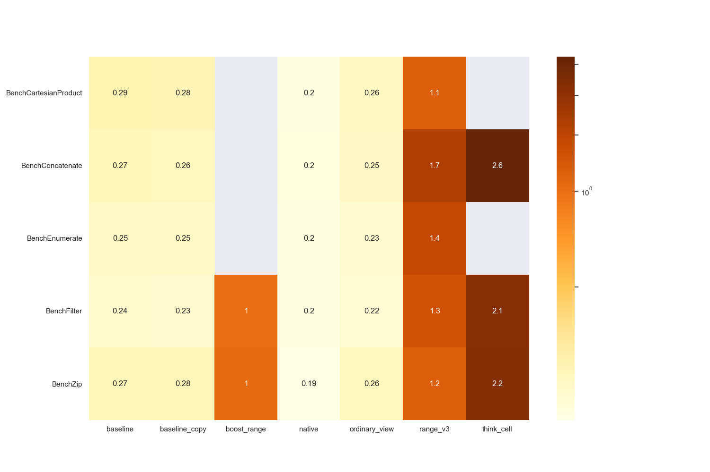
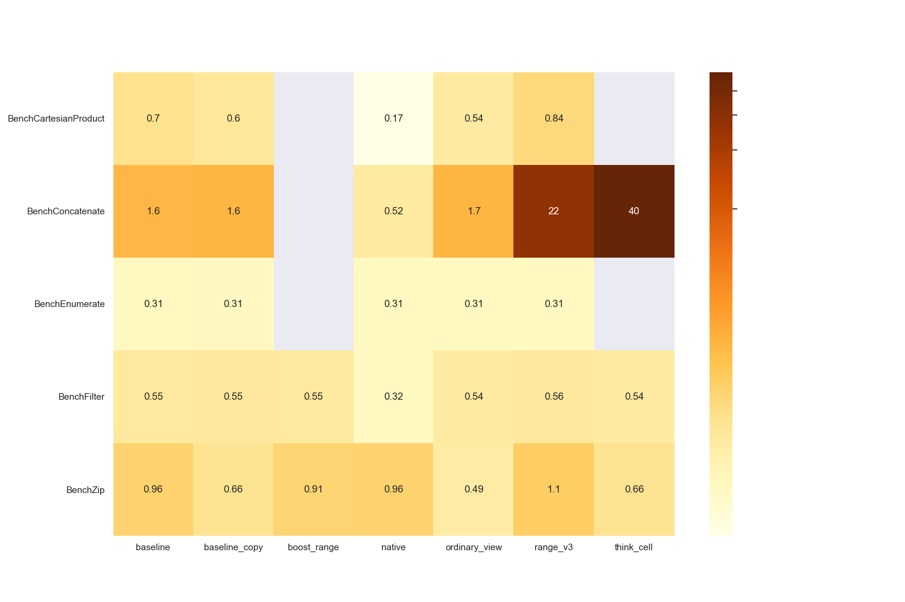

# Patterns of modern c++ library design and their impact on compile times and runtime performance

### Реализации C++ библиотеки имитирующей стандартные функции из python: enumerate, filter, zip, reversed

Это основная мотивация этой работы: написать на C++ функции enumerate, filter, zip, reversed такие же как есть в python. Эти функции должны быть удобными, то есть ими должно быть можно пользоваться так же просто как и в python. Далее они должны быть быстрыми, в идеале такими же быстрыми, как код без подобных функций, реализующий такую же логику. И, наконец, они должны быстро компилироваться, так как время компиляции больших проектов оказывает большое влияние на процесс разработки.

** Обзор существующих решений **

Есть несколько библиотек, предоставляющих упомянутые функции:

 * [boost ranges](https://github.com/boostorg/range)
 * [range-v3](https://github.com/ericniebler/range-v3)
 * [think cell](https://github.com/think-cell/range)
 
Но у них есть существенные недостатки: время работы, время компиляции и удобство. В частности, в некоторых из них реализованы не все функции, нет поддержки rvalue контейнеров, некоторые функции долго работают, долго компилируется код с использованием этих функций.

Здесь и далее будем сравнивать по набору функций: Zip, Enumerate, Filter, Concatenate, CartesianProduct.

|   | Поддержка rvalue контейнеров | Реализованные функции | 
|---|---|---|
| boost ranges | нет | Zip, Filter |
| range-v3 | нет | Zip, Enumerate, Filter, Concatenate, CartesianProduct |
| think cell | есть | Zip, Filter, Concatenate | 

** Что нового я предлагаю **

Библиотека с реализацией всех упомянутых функций, которые поддерживают rvalue аргументы, быстро компилируются и работают. Так же библиотека накладывает минимальные требования на итераторы входных контейнеров, совпадающие с требаваниями для использования контейнера в range-based for. 

** Текущие результаты **

Обозначения:
 * native - реализация без использования функций на стандартных языковых конструкциях
 * baseline, baseline_copy - реализация с использованием генераторов (объектов, подобных итераторам в python). Использованы sentinel, то есть end() в обертках имеет особый тип, не хранящий никакой информации, не совпадающий с типом begin()
 * ordinary_view - реализация "обычным" способом. begin() и end() имеют один и тот же тип, если begin() и end() входных итераторов имеют один тип. Для этих оберток и их итераторов определен минимальный набор операций и вложенных типов для использования их как аргументов в функциях стандартной библиотеки.

 Время компиляции 

 Время работы 

В ходе работы изучался сгенерированный ассемблерный код, находились способы менять С++ код, чтобы упрощать результат.

Самое значительное достижение на данный момент:

(Пере)Открыл такой паттерн: пусть вызывается inline функция f с некоторым параметром x. Так же, эта функция может работать намного быстрее при особом значении x. Тогда можно в x внести флаг того, что он является особым значением. Затем в f сделать проверку этого флага и в зависимости от него выполнять функцию по разному.

Если код получится не слишком сложным, то оптимизатор, зная, какое значение x подается в f, в конкретном случае вызова вставит код функции с вырезанной проверкой флага и ненужной веткой.

То есть получается некоторый аналог if consexpr, без его требований на условие, но целиком полагающийся на оптимизатор.

Назовем этот паттерн ** zero-cost dispatching by optimized if statement **

** Но это необходимо проверить! К сожалению не нашел никаких статей на эту тему **

** План дальнейшей работы **

* Предложить альтернативную реализацию [range-v3/view](https://github.com/ericniebler/range-v3/tree/master/include/range/v3/view)

* Провести профилирование clang, попробовать найти, где именно есть проблемы с производительностью

* Продолжить анализировать сгенерированный ассемблерный код, пробовать понять, как стоит изменить C++ код, чтобы улучшить результат его компиляции.

